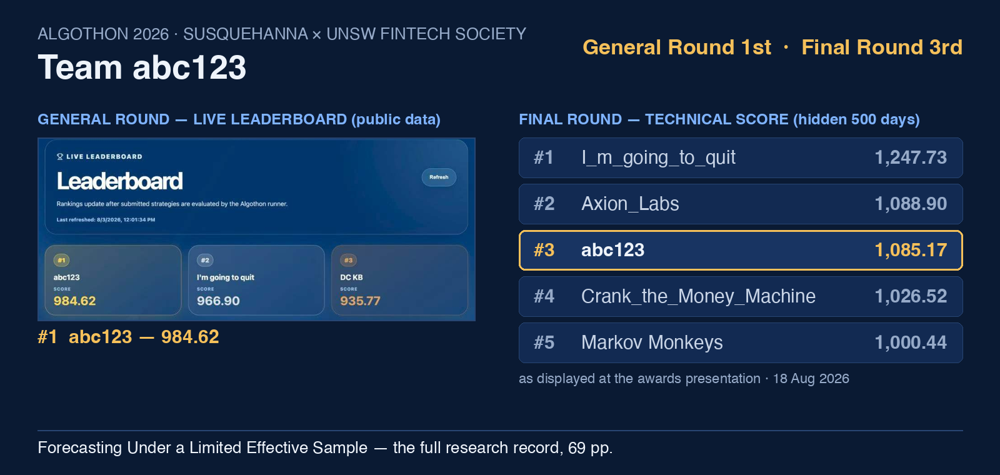

# Algothon 2026 — Team abc123

**1st on the General-round leaderboard (984.62, public data) · 3rd on the
Final-round Technical Score Leaderboard (1,085.169047, scored on 500 hidden
days).** Algothon 2026, hosted by Susquehanna International Group and the UNSW
FinTech Society.

📄 **[The full research record — *Forecasting Under a Limited Effective
Sample* (PDF, 69 pages)](Algothon-Research-Report.pdf)**

## The approach, in four decisions

1. **Differentiate the objective before optimising it.** The published score
   `mean(P&L) × SR²/(SR²+1)` was treated as a contract: a page of calculus
   settles magnitude (the caps), cost (a $104/day arithmetic ceiling against a
   ~$1,100/day book) and activity before any data is read. Only *direction*
   was left open — so that is where the entire research budget went.
2. **Count the effective sample, not the nominal one.** 1,500 days × 51 assets
   is one realised market history, not 76,500 observations. One common factor
   carries ~22% of the correlation trace; the panel holds roughly five
   independent cross-sectional units against a nominal fifty. Every downstream
   threshold assumed the small number.
3. **Price selection luck before admiring results.** A single scored block
   carries a standard error of ~131–143 points, and picking the best of a few
   hundred zero-skill variants is worth about +166 points for free. Seven
   near-relatives beat the submission on nominal score; the best margin was
   +1.14 — two orders of magnitude inside the noise. None were submitted.
4. **When nothing is demonstrably better, ship the simplest thing with the
   fewest unverified parts.** The submitted engine was explicitly *not* the
   highest score on our own leaderboard — and out of sample it landed 0.4 of
   one block's standard error from the public replay mean, 3.7 points
   (0.03 standard errors) behind second place.

The long-form write-up is in [docs/RESEARCH-NOTES.md](docs/RESEARCH-NOTES.md);
the full derivation, evidence grading and falsification record is the PDF.

## Contents

| Path | What it is |
|---|---|
| `Algothon-Research-Report.pdf` | The complete 69-page research record, with a dated postscript reading the verified outcome against thresholds fixed in advance |
| `strategy/abc123.py` | The frozen Final-round submission: a causal online ensemble, single stock engine, seven-feature non-negative logistic blend |
| `strategy/final2.py` | The predecessor engine that held 1st on the General-round leaderboard, retired when its advantage failed to survive the release boundary (report, §19) |
| `docs/RESEARCH-NOTES.md` | The approach, written up |
| `assets/cover.png` | General-round leaderboard capture + transcribed Final-round board |

## Provenance

Every artefact here is identified in the report's appendices by SHA-256:
`abc123.py` = `6674713475c09cbe…` (Appendix B/D, the frozen submission);
`final2.py` = `69274c2c09738b94…` (Appendix B, the registered predecessor).
The strategies run against the official evaluation harness in the
[algothon26-starter-code](https://github.com/UNSW-FinTech-Society-IT/algothon26-starter-code)
repository (`eval.py`, entry point `getMyPosition(prcSoFar)`).

A note the report itself insists on: the 984.62 that held 1st on the
General-round leaderboard belongs to the predecessor engine. The Final-round
submission was a simpler engine chosen on structure rather than score — the
report's §19–20 record why, and its postscript records how that choice fared
on data nobody had seen.
